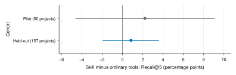

# Held-out literature comparison

The larger test does not establish a Recall@5 gain from the OpenResearch literature skill. It narrows the primary interval by 59.8% relative to the pilot.

Both methods answer 314 questions from all 157 source papers outside the pilot. Ordinary tools score 18.35% balanced Recall@5. The skill scores 19.19%. The paired difference is **+0.84 percentage points**, with a **95% interval from -1.91 to +3.57**. The interval includes zero.

## Primary result

Recall@5 measures the fraction of labeled useful papers in the first five result slots. Balanced Recall gives core and subfield questions equal weight.

The two fixed cohorts give these results:

| Cohort | Questions | Source papers | Ordinary tools | Literature skill | Difference | 95% interval |
| --- | ---: | ---: | ---: | ---: | ---: | ---: |
| Corrected pilot | 50 | 50 | 19.13% | 21.35% | +2.22 pp | -4.60 to +9.04 pp |
| Held-out comparison | 314 | 157 | 18.35% | 19.19% | +0.84 pp | -1.91 to +3.57 pp |

Each point shows skill Recall@5 minus ordinary-tools Recall@5. Each line shows its 95% interval. The held-out interval resamples whole source papers and retains both questions and both methods. The pilot resamples its distinct source papers within question types. The cohorts remain separate.

The interval width falls from 13.65 to 5.49 percentage points. The observed difference also falls. More precise evidence still does not support a skill advantage.

## Fixed method

Each held-out paper supplies one core question and one randomly selected subfield question. Seed 531 fixes the selection. All 50 pilot source papers are excluded, including their other questions. Verified identifiers and titles exclude each source paper before model exposure.

The primary comparison uses 10,000 paired source-paper bootstrap draws with seed 531. Each draw retains both questions and both methods. All failed final results score zero. No interim score difference changes the cohort or stop rule.

Both methods use `z-ai/glm-5.3-flash`, first-party Z.AI FP8, temperature zero, and low reasoning. Both use actual alphaXiv keyword and embedding searches through `orx discover`. Each method permits six searches per question, four tool rounds, and one final model turn. Four workers execute the repair. Publication cutoffs, prompts, source guards, and rank validation remain fixed.

## Failures and lineage

All 628 planned results are recorded. Each method has five failures: two search errors, two provider HTTP 520 responses, and one invalid final response. Failed requests are not repeated. Confirmed usage records cover 1,730 model responses. Four provider requests lack confirmed usage records. The scoring cohort is complete; usage confirmation is incomplete.

The experiment records preserve this sequence:

| Date | Experiment | Parent | Outcome |
| --- | --- | --- | --- |
| October 4, 2026 | First pilot | Initial plan | Input limits prevent a fair quality conclusion. |
| October 4, 2026 | Corrected pilot | First pilot | Same 50 questions; primary interval includes zero. |
| October 4, 2026 | First held-out attempt | Corrected pilot | One uncertain request stops the run after 36 successful results. |
| October 4, 2026 | Operational repair | First held-out attempt | Fresh execution of the same 314 questions; 628 results recorded. |

The interrupted attempt remains separate. Its scores are not inspected or combined with the repair. The [repair contract](repair-plan.md) fixes continuation and zero-credit rules before execution. The [original plan](plan.md) preserves the earlier stop policy.

## What to test next

Confirmed candidate coverage averages 26.13% with ordinary tools and 27.39% with the skill. Most labeled useful papers do not enter the confirmed candidate pool.

Two controlled tests can locate the remaining failure:

- Hold selection fixed and compare embedding retrieval with a keyword/embedding union on the frozen corpus. Higher candidate recall would support wider retrieval.
- Give both selection methods the same candidates. Higher final recall would support a selection change.

Recall@15, ranking quality, and question-type estimates are secondary results in the [aggregate](data/held-out.json). Their intervals also include zero.

## Evidence and limits

The comparison uses a restricted literature workflow and a live corpus. It measures coverage of sparse author labels. It does not establish relevance for unjudged papers or a gain for the full OpenResearch application. Model knowledge can include the source projects. The interval measures variation across source papers for this run, rather than variation across model seeds.

Seven positive labels fall after their question cutoff. The denominator retains those official labels. Latency is not directly comparable across experiments with different worker counts.

The dataset revision is `a5a73467500ada90db4e7641e0697a9591e41a4e`. The cohort hash is `5121c3849f1eb761a6356b5c4067f5614bc379269728edce1252b5e5f8a869b9`.

Runtime and analysis use commit [`78defeb`](https://github.com/Hadrien-Cornier/OpenResearch/tree/78defeb). All 49 local tests pass before execution. Independent review clears the operational checks. Complete traces, source metadata, and experiment records remain private. The aggregate contains verified hashes and settings. Its public fingerprint inputs omit private accounting fields.

The [offline evaluator PR](https://github.com/alphaXiv/OpenResearch/pull/531) remains separate from this experimental runner. [Read the earlier pilot](../scholarcatalyst-pilot/README.md).
