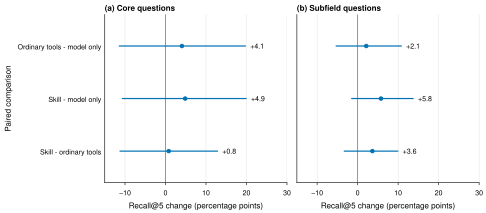

# Does the OpenResearch literature skill improve paper recall?

The corrected pilot gives 21.3% Recall@5 for the OpenResearch skill and 16.0% for the model alone. The paired uncertainty interval includes zero. This pilot does not establish a gain.

Recall@5 measures the share of author-labeled useful papers in the first five results. The experiment uses 50 [ScholarCatalyst](https://github.com/stanford-iris-lab/ScholarCatalyst) questions from 50 source papers. It includes 25 core questions and 25 subfield questions.

## Results from the corrected repeat

All three arms use GLM 5.3 Flash. The two tool arms use the same alphaXiv keyword and embedding tools.

| Arm | Core Recall@5 | Subfield Recall@5 | Balanced Recall@5 | Failed runs |
| --- | ---: | ---: | ---: | ---: |
| Model only | 23.4% | 8.7% | 16.0% | 1 |
| Ordinary tools | 27.5% | 10.8% | 19.1% | 1 |
| OpenResearch skill | 28.3% | 14.4% | 21.3% | 1 |

The primary comparison is the skill against ordinary tools. Its mean difference is **+2.2 percentage points**, with a 95% interval from **-4.6 to +9.0**. The skill against the model alone gives **+5.3 points**, with an interval from **-3.2 to +13.9**. Both intervals include zero.

The analysis uses 10,000 paired bootstrap samples. It resamples source papers within each question type and gives both types equal weight. One cohort seed, `530`, selects the questions. These intervals measure variation across source papers. They do not measure variation across model seeds.

All difference intervals include zero. Panel (a) shows core questions. Panel (b) shows subfield questions. Points show mean differences. Lines show 95% project bootstrap intervals. Positive values favor the first arm in each label.

## What limits performance?

The skill sees only **34.6%** of known positive papers for core questions and **21.3%** for subfield questions. These counts use tool payloads in confirmed model responses. They include runs with failed final answers. Most known useful papers never reach the candidate pool.

That result makes candidate access the highest-value next check. A longer final-selection prompt cannot select a paper absent from its candidates. Selection also matters: candidate coverage exceeds final Recall@5 in both groups.

The corrected repeat has one invalid model-only JSON answer and two search failures. Each arm has one failure. Failed and missing final results receive zero credit. Invalid and unjudged papers retain their ranking positions. Duplicate positives receive credit once.

## First pass and corrected repeat

Both passes use the same 50 source papers. The first pass loses 34 skill runs at a conservative input reservation bound and one skill run to a search failure. Two ordinary-tool runs also reach that bound. The repeat raises the common input reservation cap from 80,000 to 320,000. It preserves the first pass and its failures.

## Method and evidence

The model choice uses the current [Artificial Analysis GLM 5.3 Flash results](https://artificialanalysis.ai/models/glm-5-3-flash). The endpoint is first-party Z.AI FP8. Reasoning effort is `low`; the general model index does not predict this setting's retrieval score.

The model, provider, temperature, reasoning setting, prompts, tool limits, guards, and metrics stay fixed across the repeat. The source skill matches the installed `orx 0.2.13` skill byte for byte. Each tool arm permits six searches and five model calls. Final lists contain at most 15 papers. Tool payloads preserve live identifiers and hide benchmark membership.

Task information contains the question and cutoff. The model also receives its arm's instructions and permitted tool payloads. Source identifiers, source titles, and gold labels stay outside model context. A batch arXiv metadata request supplies 45 missing source titles for exclusion guards. All 50 guard titles are known.

The selected labels contain 258 positive pairs and no cutoff conflict. The official gold denominator stays unchanged.

This is a restricted workflow replay with alphaXiv discovery. Its common scoring rule preserves unsupported ranks and changes the skill's native final drop step. It does not exercise all OpenResearch connectors or the native coding-agent integration. The live corpus differs from the official frozen corpus. Sparse labels do not establish the relevance of unjudged papers. Model knowledge can include the original source projects.

The public records contain aggregate values and verified hashes. Public hashes identify the complete private configuration. Public snapshots contain the settings needed to interpret retrieval behavior:

- [Corrected repeat](data/replication.json)
- [First pass](data/first-pass.json)
- [Vector plot](figures/paired-recall.pdf)
- [Plot script](figures/paired-recall.py)
- [Runner and protocol](../../docs/scholarcatalyst-live-diagnostic.md)

Complete requests, responses, tool snapshots, source metadata, cohort mappings, failures, and ledgers remain in the private evidence directory. Raw benchmark data and traces stay outside this repository.

The contribution begins with [issue #530](https://github.com/alphaXiv/OpenResearch/issues/530) and [evaluator PR #531](https://github.com/alphaXiv/OpenResearch/pull/531). The live runner and this evidence remain on the separate experimental branch. The offline evaluator passes 11 tests. The runner passes 13 tests. The analysis passes three tests. Independent reviews find no scoring or privacy blocker. Upstream PR CI still needs maintainer approval.

## Choose the next experiment

Three directions answer different questions:

- **Inspect candidate misses.** Check whether useful papers are absent because of search queries, service coverage, or source filters. Test verified model-recalled papers as additional candidates.
- **Run a frozen comparison.** Match the corpus across direct retrieval and the agent workflow. This isolates the effect of search and selection policies.
- **Test robotics questions.** Use the papers and questions that matter to your work. This tests whether a benchmark gain transfers to your actual research.

Inspect candidate misses first. This check targets the measured bottleneck before a larger run or a production change.
